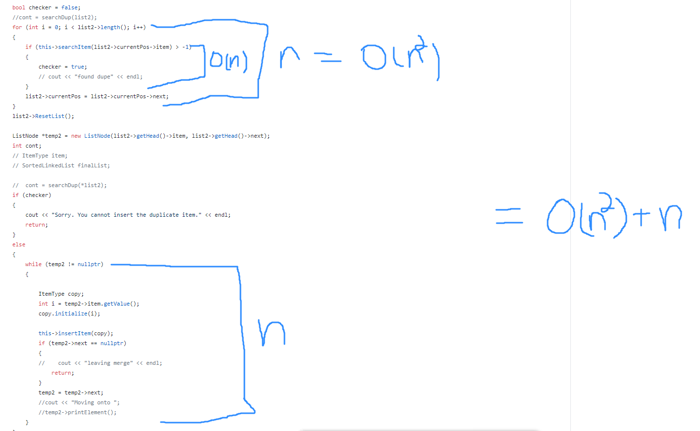

# Mattson_Alexander_Assignment4
CSCI 2720: Assignment 2 - Sorted Linked List
[To pair remote key with odin](https://github.com/cs1302uga/cs1302-tutorials/blob/master/github-setup.md#setting-up-ssh-keys)

Rachel Mattson
811951277
ram13275@uga.edu

Sarah Alexander
811190156
sa29588@uga.edu

======================  changes to be made ===========

Circular
    - in main: insert (i), delete (d), length (l), print (p), deleteSub (b), mode (m),

Doubly
    - 

NodeType
    -make it with data, fwd, and backward, use for both list classes

swapAlternate, 

We partner coded for most of the classes. Rachel spent more time implementing merge, intersect, deleteAlt while Sarah spent time figuring out the time complexities. 

Major Steps to complete:

1) Construct classes
2) Implement merge, delete alt nodes, find common elements
3) properly take in input in main to access functions
4) Makefile, README, etc

Pseudocode for Intersection:

For our intersection method, we created a new SortedLinkedList and a ListNode was created to access the elements of the SortedLinkedList being passed in. We then had a while loop to loop through the list being passed in. Within the while loop, we have an if statement that uses our searchItem method in order to find values that are the same. After confirming a value was found that was the same, an ItemType object was created to initialize and insert items into a final list. It loops through until the next item is null, which then causes the loop to break. At the end of the method, we return the final list. 

Time Complexity of Intersection:

The while loop we have in our intersection method runs up to 'n' times and the if statement that utilizes the searchItem method with the complexity 'O(n)'. This causes our intersection method to have a time complexity of O(n^2). Instead of using searchItem, one constructs two incrementors for the two lists. They increment up to n1 and n2 respectively. Utilizing this method, one is able to iterate through the lists simultaneously. Its resulting time complexity is 'O(n1 + n2)'. Unfortunately, our algorithm did not achieve this efficiency. 

Pseudocode for Merge:

For our merge method, we looped through the length of the second list and used our searchItem method to compare each list item to our original list in order to find duplicates. After confirming there are no duplicates being added, we used a while loop to iterate through the list and we make a copy of the items and insert that copy into the original list. 

Time Complexity of Merge:

The for loop we have in our merge method runs up to 'n' times. Within this for loop, we utilize our searchItem method, which has a time complexity of 'O(n)'. This section has a total time complexity of O(n^2). The while loop we have in our merge method runs up to 'n' times and we use the insertItem method which runs less than 'n' times inside the while loop. This causes the second section to have a time complexity of 'O(n^2)' as well. Combining the complexity of the two sections still results in a time complexity contained in 'O(n^2)'. More efficient methods exist, such as the K-Way merge function, which has the time complexity O(n)log(k). This function achieves this lower complexity because it has a much lower searchItem method. (It is the parent of the binary search method) Unfortunatley, our algorithm did not achieve this efficiency. 

Compiling contructions:

Use `make run` to run the file with input.txt seeding the list.
To enter in a different command line argument, use `make` to compile the code, then `./bin/main <your_filename>` to run the program.

To check that there are no memory leaks, compile everything with `make` then run valgrind --leak-check=yes -s ./bin/main input.txt 

