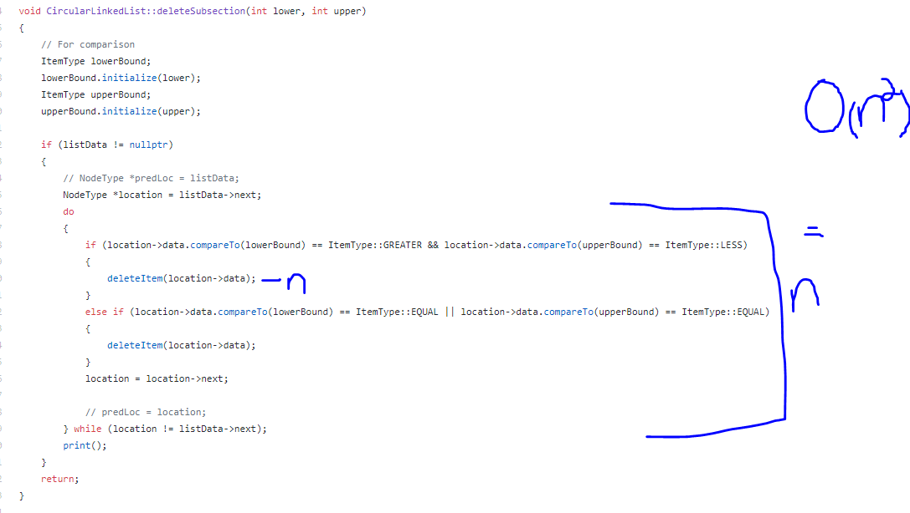
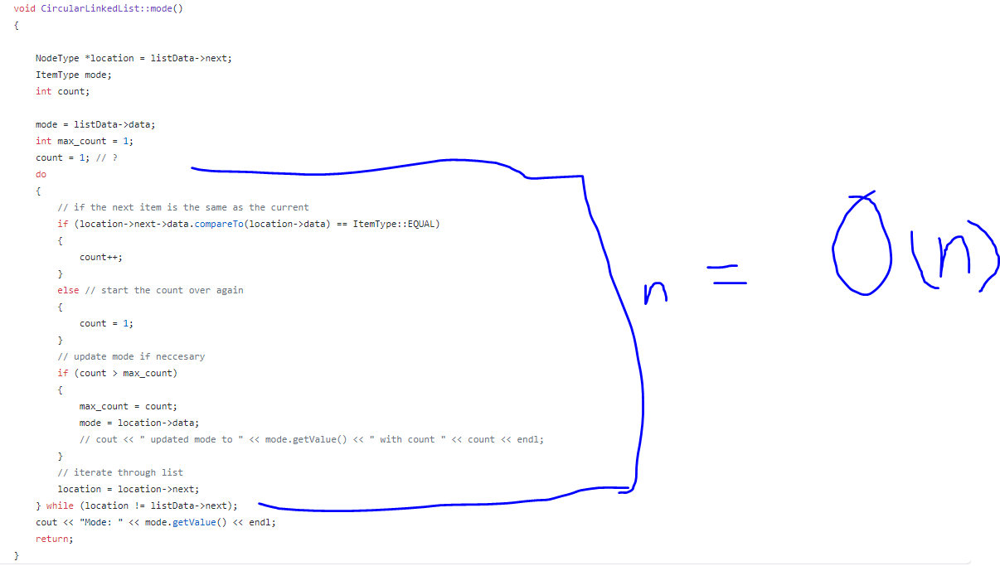
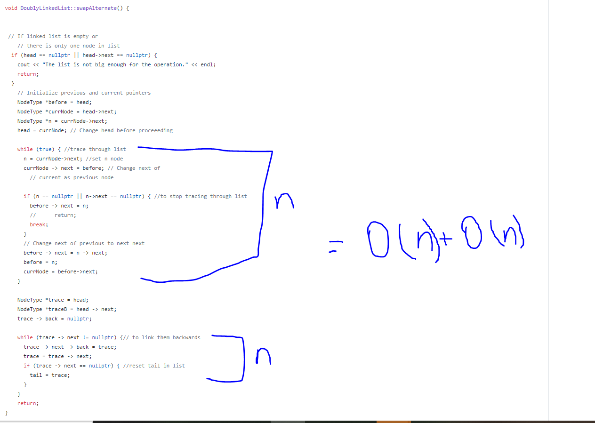

# Mattson_Alexander_Assignment4

Rachel Mattson
811951277
ram13275@uga.edu

Sarah Alexander
811190156
sa29588@uga.edu

We split the two classes, Rachel doing CircularLinkedList and Sarah doing DoublyLinkedList. We partner coded to figure out the larger errors, get some methods working, and work through the pseudocode/O(n).

Circular Linked List:
Pseudocode for deleteSubsection:

For our intersection method, we created a new SortedLinkedList and a ListNode was created to access the elements of the SortedLinkedList being passed in. We then had a while loop to loop through the list being passed in. Within the while loop, we have an if statement that uses our searchItem method in order to find values that are the same. After confirming a value was found that was the same, an ItemType object was created to initialize and insert items into a final list. It loops through until the next item is null, which then causes the loop to break. At the end of the method, we return the final list. The Big O for this cuntion ended up being O(n^2) because it traces back to using the findItem method which has a time complexity of O(n) within a while loop in deleteSubsection. 

Since we need to find a upper and lower bound less than n, it is reasonable to expect most algorithms will be in the set O(n).

Pseudocode for mode: 

We iterate through the list, keeping track of how many times we pass through groups of nodes of equal data values. If the next node is the same as the previous, we increase the size of the group, and if it is not the same we restart the group count. Each time we find a group of equivalent nodes that is larger than the last group, we update the mode. This will pass through the list of size n once, so the time complexity is O(n). This is actually a pretty efficient; the task of finding the mode will probably require checking every item in a list, so at least O(n) is to be expected. 

Doubly Linked List:
PseudoCode for SwapAlternates

We made sure the head is not nullpointer or the node after head in order to ensure we have something to swap. We then make three NodeTypes to keep track of nodes we are currently on or ones that we want to swap. We then used a while loop to iterate through the list of nodes and would reset our three NodeTypes to point to corresponding nodes that we wanted to swap. If the node that was pointing to the next node after our current one was null, we broke the loop. We then had another while loop outside the one iterating through the list in order to link the nodes backwards, making it doubly linked. This will cause our time complexity for the swap alternate method to be O(n). 

We first check that the list is not empty, redirecting the user if this is the case. Then we iterate though the list and swap from every other node. We use std::swap which has O(n) according to c++ documentation. We call this up to n/2 times, so the overall complexity of this function is O(.5n\*n) = O(n^2). This could be done with a complexity of O(n) if implemented recursively, as in this method two on [geeksforgeeks](https://www.geeksforgeeks.org/pairwise-swap-elements-of-a-given-linked-list/).

Compiling contructions:

cd into `DoublyLinkedList` or `CircularLinkedList`. Use `make run` to run the file with input.txt seeding the list.
To enter in a different command line argument, use `make` to compile the code, then `./main <your_filename>` to run the program.

To check that there are no memory leaks, compile everything with `make` then run valgrind --leak-check=yes -s ./main input.txt 

